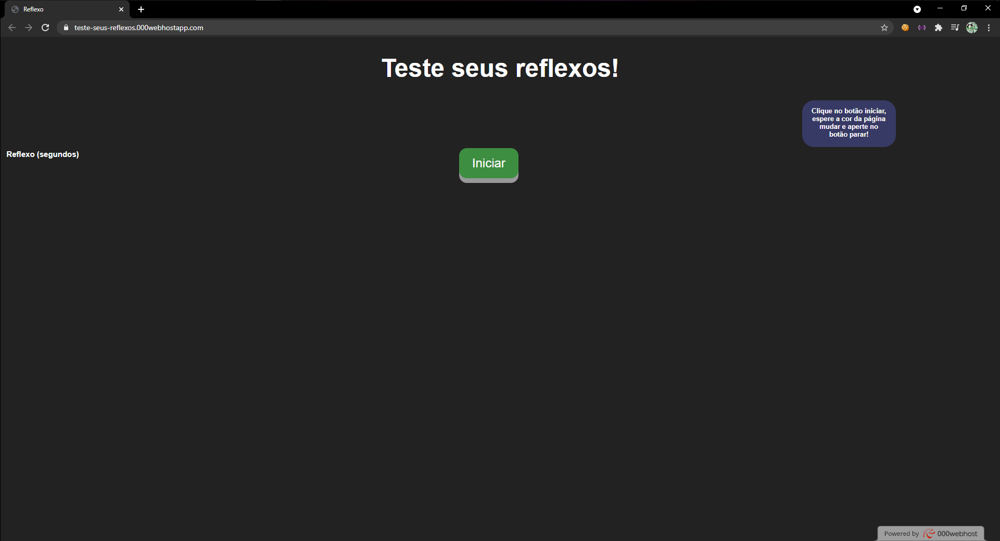
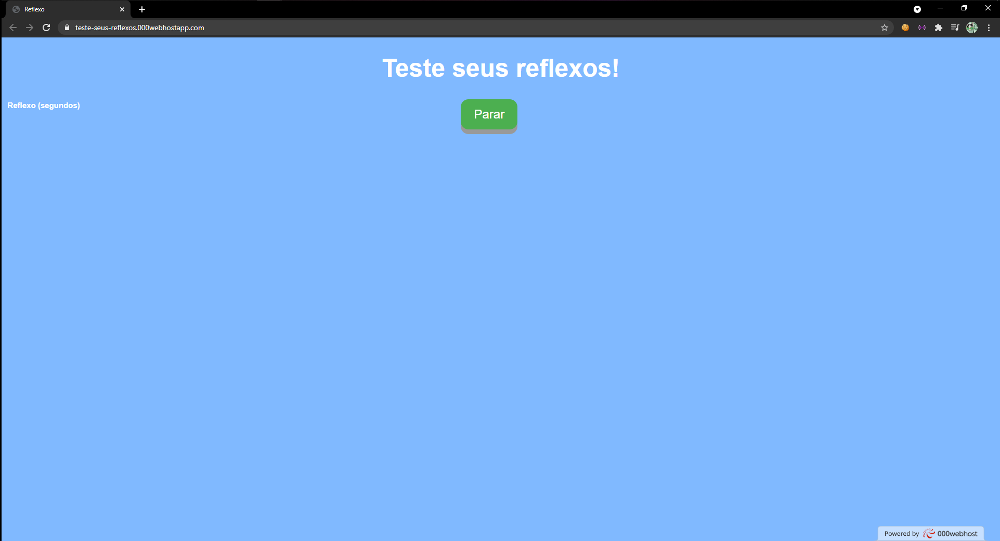
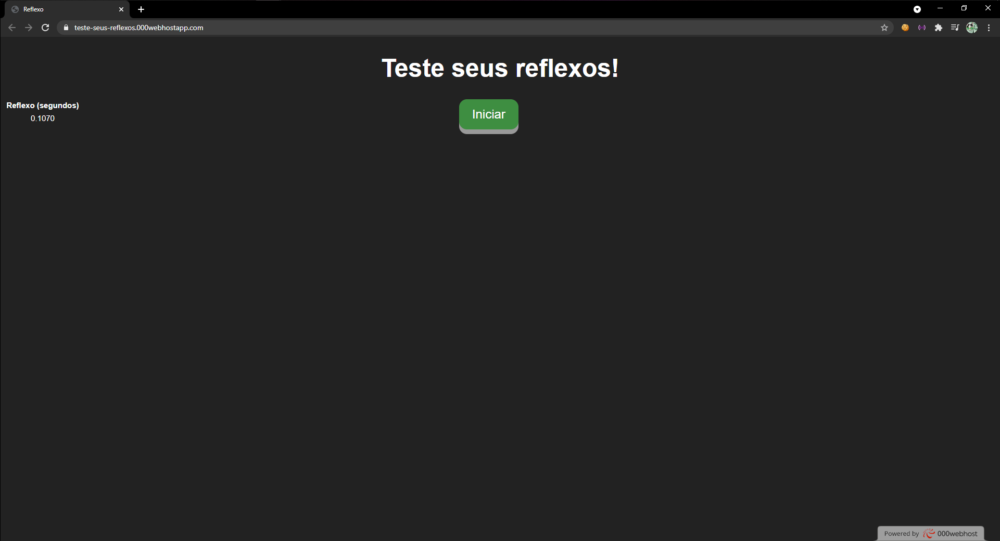

# ProjetoReflexo
<h3> Uma página em javascript onde o usuário pode testar seus reflexos! </h3>  
Usuario aperta o botão  
  
A cor muda  
  
O usuario aperta o botão o mais rapido possível e os resultados aparecem na esquerda!  

